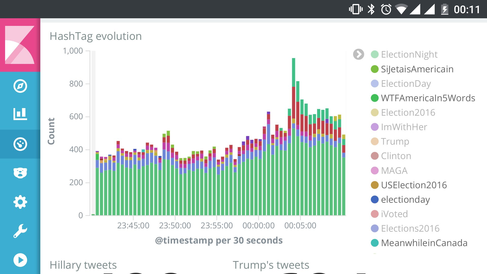
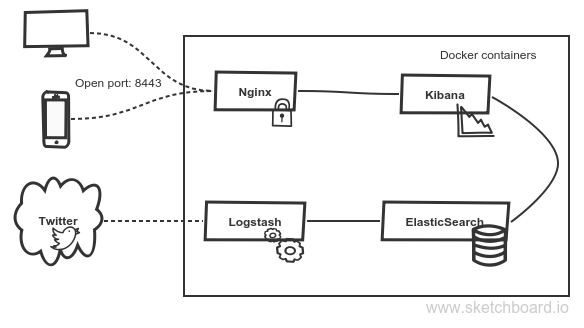

# ELK Container

This repository contains a docker-compose configuration to launch an ELK stack (http://elastic.co).

By default, the stack is configured to retrieve tweets matching some keywords, then index in Elasticsearch. With Kibana, you will be able to do some visualization:



The docker-compose configuration will launch the following components:

* Elasticsearch for data storage and indexing
* Logstash for data ingestion from twitter, logstash configuration is read from logstash/logstash.conf
* Kibana for data visualization
* Nginx for SSL access to Kibana



Elasticsearch data is stored on host file system in _../elk-container-data_

## Usage

__Pre-requisite__: [Docker Compose](https://docs.docker.com/compose/) must be installed to run the stack.

1. Clone this repository
2. Create a .env file in newly created directory with following environment variables defining your Twitter credentials:
```bash
CONSUMER_KEY=...
CONSUMER_SECRET=...
OAUTH_TOKEN=...
OAUTH_TOKEN_SECRET=...
```
3. Create a _../elk-container-data_ directory
4. Create key pair for Nginx
```bash
mkdir -p ../elk-container-data/ssl
openssl req -batch -x509 -nodes -days 365 -newkey rsa:2048 \
            -keyout ../elk-container-data/nginx.key \
            -out ../elk-container-data/nginx.crt
```
5. Create a password
```bash
    htpasswd -c ../elk-container-data/htpasswd <username> <password>
```
6. Launch docker-compose
```bash
    docker-compose up -d
```
7. Open Kibana at https://localhost:8443/kibana
8. Enjoy!
